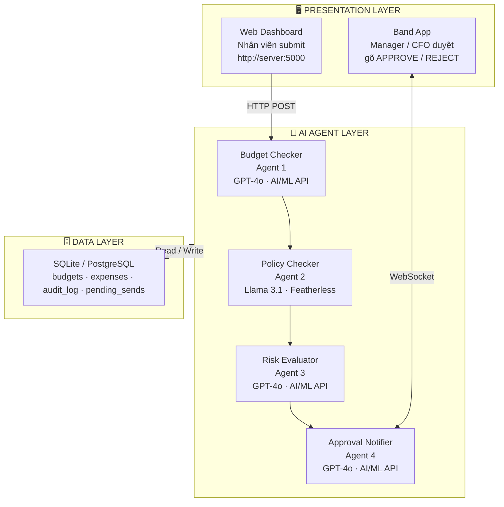
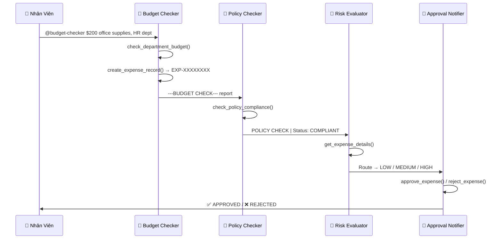
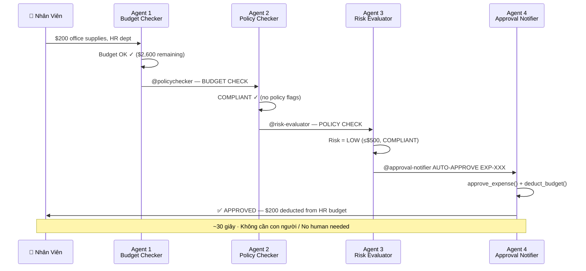
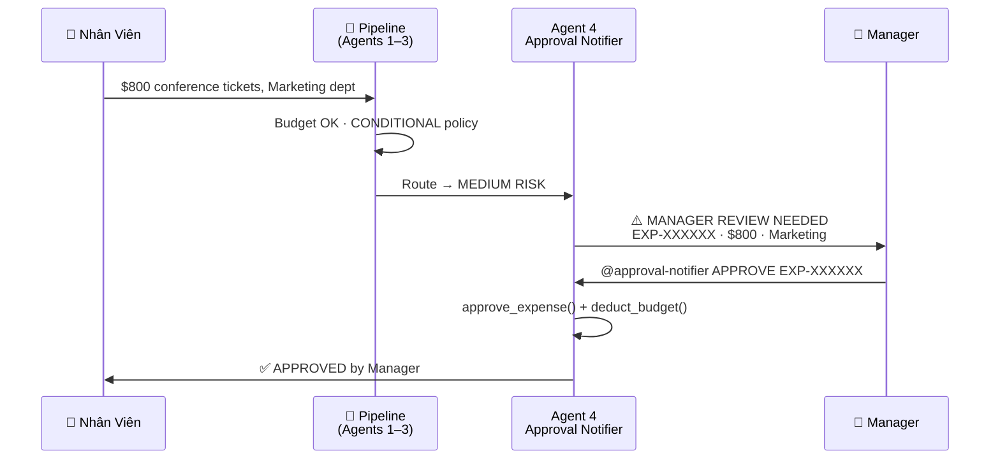
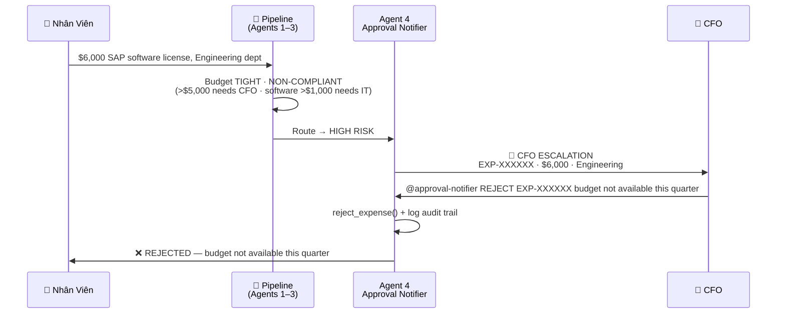

# 🤖 AI-Powered Expense Approval System

> **Band of Agents Hackathon 2026 — Track 1: Internal Enterprise Workflows**

Hệ thống duyệt chi phí doanh nghiệp tự động, sử dụng 4 AI agent chuyên biệt phối hợp qua Band.  
*An automated enterprise expense approval system powered by 4 specialized AI agents collaborating through Band.*

Pipeline xử lý từ đầu đến cuối — kiểm tra ngân sách, compliance, đánh giá rủi ro, và ra quyết định cuối cùng — chỉ leo thang đến con người khi thực sự cần thiết.  
*The pipeline handles everything end-to-end — budget validation, compliance checking, risk evaluation, and final decisions — escalating to humans only when genuinely necessary.*

---

## 📋 Mục lục / Table of Contents

1. [Vấn đề & Giải pháp / Problem & Solution](#1-vấn-đề--giải-pháp--problem--solution)
2. [Tác nhân sử dụng / Stakeholders](#2-tác-nhân-sử-dụng--stakeholders)
3. [Kiến trúc hệ thống / Architecture](#3-kiến-trúc-hệ-thống--architecture)
4. [Sơ đồ luồng xử lý / Flow Diagrams](#4-sơ-đồ-luồng-xử-lý--flow-diagrams)
5. [Chi tiết 4 AI Agent / Agent Details](#5-chi-tiết-4-ai-agent--agent-details)
6. [Human-in-the-Loop](#6-human-in-the-loop)
7. [Tech Stack](#7-tech-stack)
8. [Cài đặt & Chạy / Setup & Running](#8-cài-đặt--chạy--setup--running)
9. [Demo Scenarios](#9-demo-scenarios)
10. [Scale lên Enterprise / Enterprise Scaling](#10-scale-lên-enterprise--enterprise-scaling)
11. [Cấu trúc Project / Project Structure](#11-cấu-trúc-project--project-structure)

---

## 1. Vấn đề & Giải pháp / Problem & Solution

### 🔴 Vấn đề thực tế / The Problem

Trong doanh nghiệp, quy trình duyệt chi phí thủ công gặp nhiều bất cập:  
*In enterprises, manual expense approval processes face many pain points:*

- Mất **2–3 ngày** xử lý mỗi yêu cầu do phải chuyền tay qua nhiều phòng ban *(2–3 days to process each request due to handoffs across departments)*
- Manager phải duyệt **cả những khoản nhỏ** không cần thiết, lãng phí thời gian *(Managers must approve even small, low-risk expenses — wasting their time)*
- Dễ **sai sót**: nhầm ngân sách, bỏ qua quy định policy *(Human error: wrong budget allocation, overlooked policy rules)*
- Không có **audit trail** rõ ràng khi xảy ra tranh chấp *(No clear audit trail when disputes arise)*
- Không có **cảnh báo sớm** khi ngân sách sắp cạn *(No early warning when budgets are nearly exhausted)*

### 🟢 Giải pháp / The Solution

4 AI agent chuyên biệt phối hợp tự động qua Band:  
*4 specialized AI agents collaborating automatically through Band:*

| Trước — Thủ công / Before (Manual) | Sau — AI Agent / After (AI Agent) |
|---|---|
| ⏳ 2–3 ngày xử lý / 2–3 days to process | ⚡ ~30 giây (LOW risk) / ~30 seconds |
| 👤 Manager duyệt tất cả / Manager approves everything | 🤖 Chỉ leo thang khi cần / Escalates only when needed |
| ❌ Dễ quên quy định / Easy to miss policy rules | ✅ Policy check tự động 100% / Fully automated policy checks |
| 📭 Không có audit trail / No audit trail | 📋 Mọi hành động đều được ghi lại / Every action is logged |
| ❓ Không biết ngân sách còn bao nhiêu / Unknown budget balance | 📊 Real-time budget tracking |

---

## 2. Tác nhân sử dụng / Stakeholders

| Tác Nhân / Stakeholder | Vai Trò / Role | Công Cụ / Tool | Tần Suất / Frequency |
|---|---|---|---|
| 👨‍💼 **Nhân viên** / *Employee* | Gửi yêu cầu chi phí, theo dõi kết quả / *Submit expense requests, track results* | Web Dashboard | Hàng ngày / *Daily* |
| 👔 **Manager** | Duyệt/từ chối chi phí MEDIUM risk / *Approve/reject MEDIUM risk expenses* | Band | Khi có thông báo / *On notification* |
| 💼 **CFO** | Duyệt/từ chối chi phí HIGH risk (>$1,500) / *Approve/reject HIGH risk expenses* | Band | Khi có leo thang / *On escalation* |
| 🔧 **IT Admin** | Cài đặt và vận hành hệ thống / *Install and operate the system* | VPS + Docker | Setup 1 lần / *One-time setup* |
| 🤖 **4 AI Agents** | Xử lý pipeline tự động 24/7 / *Automated 24/7 pipeline processing* | Band SDK + LLM | Tức thì / *Instant* |

---

## 3. Kiến trúc hệ thống / Architecture

### 3-Layer Architecture



### Agent Communication Flow / Luồng giao tiếp Agent



---

## 4. Sơ đồ luồng xử lý / Flow Diagrams

### 4.1 LOW Risk — $200 ✅ (Auto-approved / Tự động duyệt ~30 giây)



### 4.2 MEDIUM Risk — $800 ⚠️ (Manager review)



### 4.3 HIGH Risk — $6,000 🚨 (CFO escalation)



---

## 5. Chi tiết 4 AI Agent / Agent Details

### 🔵 Agent 1 — Budget Checker

**Model:** GPT-4o via AI/ML API

Điểm đầu vào của pipeline. Nhận yêu cầu bằng ngôn ngữ tự nhiên, phân tích, kiểm tra ngân sách, tạo database record.  
*Pipeline entry point. Receives natural language requests, parses them, validates budget, and creates a database record.*

| | |
|---|---|
| **Tools** | `create_expense_record`, `check_department_budget`, `log_agent_action` |
| **Input** | Natural language: `$800 AWS software, Engineering, vendor: Amazon` |
| **Output** | Structured report → sent to `@policychecker` via Band |

**Output format:**
```
---BUDGET CHECK---
Expense ID:  EXP-A1B2C3D4
Requester:   Nguyen Van A
Amount:      $800
Department:  Engineering
Type:        software
Vendor:      Amazon
Budget Left: $6,900 (OK ✓)
---END BUDGET CHECK---
```

---

### 🟡 Agent 2 — Policy Checker

**Model:** Llama 3.1 70B via Featherless AI

Chuyên gia compliance độc lập. Kiểm tra các quy định nội bộ và gửi kết quả đến Risk Evaluator.  
*An independent compliance expert. Validates internal policy rules and forwards results to the Risk Evaluator.*

| | |
|---|---|
| **Tools** | `check_policy_compliance` |
| **Input** | Budget Check report from Band room |
| **Output** | `POLICY CHECK \| Expense ID: ... \| Status: COMPLIANT \| Blocking: None` |

**Policy rules checked / Các quy định được kiểm tra:**

| Rule / Quy tắc | Condition / Điều kiện |
|---|---|
| Software approval | > $1,000 → cần IT pre-approval |
| CFO sign-off | > $5,000 → cần CFO ký duyệt |
| Travel notice | > $500 → cần báo trước 2 tuần |
| Hardware tracking | > $500 → cần theo dõi asset |
| Banned keywords | `personal`, `gift`, `alcohol`, `entertainment`, `casino` |

---

### 🟠 Agent 3 — Risk Evaluator

**Model:** GPT-4o via AI/ML API

Bộ não ra quyết định. Đọc cả hai báo cáo từ lịch sử Band room và routing đến kết quả phù hợp.  
*The decision-making brain. Reads both reports from Band room history and routes to the appropriate outcome.*

| | |
|---|---|
| **Tools** | `get_expense_details` |
| **Input** | Full Band room history (Budget + Policy reports) |
| **Output** | Risk report + routing instruction |

**Risk routing logic / Logic phân loại rủi ro:**

| Risk Level | Condition / Điều kiện | Action |
|---|---|---|
| 🟢 **LOW** | amount ≤ $500 **AND** COMPLIANT **AND** budget OK | Auto-approve |
| 🟡 **MEDIUM** | amount ≤ $1,500 **OR** CONDITIONAL | Manager review |
| 🔴 **HIGH** | amount > $1,500 **OR** NON-COMPLIANT **OR** budget exceeded | CFO escalation |

---

### 🟣 Agent 4 — Approval Notifier

**Model:** GPT-4o via AI/ML API

Bộ phận hoàn tất. Xử lý mọi quyết định (tự động hoặc từ con người), cập nhật database, thông báo kết quả.  
*The finalization unit. Handles all decisions (automated or human), updates the database, and notifies stakeholders.*

| | |
|---|---|
| **Tools** | `get_expense_details`, `approve_expense`, `reject_expense`, `log_agent_action` |
| **Input Type A** | Auto-approve instruction from Risk Evaluator |
| **Input Type B** | `APPROVE` / `REJECT` command from human (Manager / CFO) |
| **Input Type C** | Partial approval with adjusted amount |

---

## 6. Human-in-the-Loop

**Thiết kế cốt lõi:** AI xử lý tự động khi an toàn, giao con người khi rủi ro cao.  
*Core design principle: AI handles automatically when safe, hands off to humans when risk is high.*

| Risk Level | Ai quyết định? / Who decides? | Thời gian / Time | Cách thực hiện / How |
|---|---|---|---|
| 🟢 **LOW** (≤$500) | 🤖 AI tự động / AI Auto | ~30 giây / ~30 sec | Không cần người / No human needed |
| 🟡 **MEDIUM** ($500–$1,500) | 👔 Human Manager | Manager quyết định / Manager decides | `@approval-notifier APPROVE EXP-XXX` |
| 🔴 **HIGH** (>$1,500) | 💼 CFO | CFO quyết định / CFO decides | `@approval-notifier APPROVE EXP-XXX` hoặc / or `@approval-notifier REJECT EXP-XXX [lý do / reason]` |

> 💡 **Con người không cần biết gì về kỹ thuật** — chỉ cần đọc báo cáo trong Band và gõ lệnh đơn giản.  
> *Humans don't need any technical knowledge — just read the report in Band and type a simple command.*

---

## 7. Tech Stack

| Component | Technology |
|---|---|
| Agent Framework | Band SDK + LangGraph ReAct |
| LLM — Budget, Risk, Approval | GPT-4o via AI/ML API |
| LLM — Policy Checker | Llama 3.1 70B via Featherless AI |
| Agent Communication | Band (WebSocket + REST API) |
| Database | SQLite (demo) → PostgreSQL (production) |
| Web Dashboard | Flask + HTML/CSS/JS |
| Infrastructure | Docker + Docker Compose |
| Deploy | Linux VPS (24/7) |

---

## 8. Cài đặt & Chạy / Setup & Running

### Option A — Docker (Khuyến nghị cho VPS / Recommended for VPS)

```bash
git clone https://github.com/thanhvuaws-jpg/band-expense-approval-agents.git
cd band-expense-approval-agents

cp .env.example .env
nano .env          # điền API keys / fill in API keys

docker compose up -d --build
```

Dashboard: `http://YOUR_IP:5000`

---

### Option B — Local (Windows)

```bash
git clone https://github.com/thanhvuaws-jpg/band-expense-approval-agents.git
cd band-expense-approval-agents

python -m venv .venv
.venv\Scripts\activate
pip install -e .

cp .env.example .env
# điền .env với API keys của bạn / fill .env with your API keys

start.bat    # mở 2 terminal tự động / auto-opens 2 terminals
```

---

### Cấu hình `.env` / Environment Variables

```env
BAND_BUDGET_CHECKER_ID=your-agent-id
BAND_BUDGET_CHECKER_KEY=band_a_...

BAND_POLICY_CHECKER_ID=your-agent-id
BAND_POLICY_CHECKER_KEY=band_a_...

BAND_RISK_EVALUATOR_ID=your-agent-id
BAND_RISK_EVALUATOR_KEY=band_a_...

BAND_APPROVAL_NOTIFIER_ID=your-agent-id
BAND_APPROVAL_NOTIFIER_KEY=band_a_...

AIML_API_KEY=your-aiml-key
FEATHERLESS_API_KEY=your-featherless-key
```

---

### Bước cuối — Tạo Band room / Final Step — Create Band Room

1. Tạo room mới trên Band / *Create a new room in Band*
2. Invite cả 4 agent vào room / *Invite all 4 agents to the room*
3. Test bằng cách gõ lệnh trong room / *Test by typing a command in the room*

---

## 9. Demo Scenarios

### ✅ Scenario 1 — LOW Risk (Auto-approved / Tự động duyệt ~30 giây)

**Command:**
```
@budget-checker $200 office supplies, HR dept, vendor: Staples
```

**Pipeline:**
```
Budget OK → COMPLIANT → LOW Risk → ✅ Auto-approved
$200 deducted from HR budget
```

---

### ⚠️ Scenario 2 — MEDIUM Risk (Manager review)

**Command:**
```
@budget-checker $800 conference tickets, Marketing dept, vendor: Eventbrite
```

**Pipeline:**
```
Budget OK → CONDITIONAL → MEDIUM Risk → ⚠️ Manager notified
```

**Manager duyệt / Manager approves:**
```
@approval-notifier APPROVE EXP-XXXXXX
```

---

### 🚨 Scenario 3 — HIGH Risk (CFO escalation)

**Command:**
```
@budget-checker $6000 SAP software license, Engineering dept, vendor: SAP
```

**Pipeline:**
```
Budget TIGHT → NON-COMPLIANT (>$5,000 needs CFO · software >$1,000 needs IT)
→ HIGH Risk → 🚨 CFO notified
```

**CFO từ chối / CFO rejects:**
```
@approval-notifier REJECT EXP-XXXXXX budget not available this quarter
```

---

### 🖥️ Scenario 4 — Web Dashboard

1. Mở / *Open* `http://YOUR_IP:5000`
2. Điền form: họ tên, số tiền, phòng ban, mô tả, vendor / *Fill the form: name, amount, department, description, vendor*
3. Bấm **Gửi Yêu Cầu** / *Click **Submit Request***
4. Pipeline tự động chạy / *Pipeline runs automatically*
5. Kết quả hiện trong Band và dashboard / *Results appear in both Band and the dashboard*

---

## 10. Scale lên Enterprise / Enterprise Scaling

Hiện tại là **demo hoạt động thật** — pipeline đầy đủ, deploy trên VPS 24/7.  
*Currently a **fully working demo** — complete pipeline, deployed on VPS 24/7.*

| Hạng Mục / Feature | 🧪 Demo (Hiện Tại / Current) | 🏢 Production (Enterprise) |
|---|---|---|
| Database | SQLite | PostgreSQL / MySQL HA |
| Authentication | Không có / None | SSO / OAuth2 (Google, Microsoft) |
| Notification | Band only | Band + Email + Slack |
| Multi-tenant | 1 công ty, 1 room / *1 company, 1 room* | Nhiều công ty, room riêng mỗi phòng ban / *Multi-company, per-dept rooms* |
| Scale | Single VPS | Kubernetes / Cloud Run |
| Monitoring | Docker logs | Grafana + Prometheus |

---

## 11. Cấu trúc Project / Project Structure

```
band-expense-approval-agents/
│
├── main.py              # 4 AI agents + message sender
├── dashboard.py         # Flask web UI (employee submission form)
├── tools.py             # LangChain tools wrapping SQLite operations
├── db.py                # Database layer (budgets, expenses, audit log)
├── monitor.py           # Budget monitor (zero LLM cost)
│
├── Dockerfile           # Docker image definition
├── docker-compose.yml   # 2 services: agents + dashboard
├── start.bat            # One-click launcher (Windows)
├── pyproject.toml       # Python dependencies
└── .env.example         # Environment variable template
```

---

## 📄 License

MIT

---

<div align="center">

**Built for Band of Agents Hackathon 2026 · Track 1: Internal Enterprise Workflows**

*Powered by Band SDK · AI/ML API (GPT-4o) · Featherless AI (Llama 3.1 70B)*

</div>